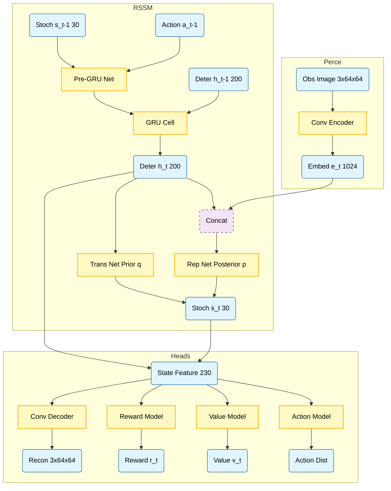

# DreamerV1 Algorithm Reference

This document follows the pseudo-algorithm from the DreamerV1 paper (**"Dream to Control: Learning Behaviors by Latent Imagination"**).

## Main Loop

1.  Initialize dataset $\mathcal{D}$ with $S$ random seed episodes.
2.  Initialize neural network parameters $\theta, \phi, \psi$ randomly.
3.  **while** not converged **do**:
    - **for** update step $c = 1 \dots C$ **do**:
        - **// Dynamics Learning**
        - Draw $B$ data sequences {$(a_t, o_t, r_t)$}$_{t=k}^{k+L} \sim \mathcal{D}$.
        - Compute model states $s_t \sim p_\theta(s_t \mid s_{t-1}, a_{t-1}, o_t)$.
        - Update $\theta$ using representation learning (Reconstruction + Reward + KL).
        
        - **// Behavior Learning**
        - Imagine trajectories {$(s_\tau, a_\tau)$}$_\{\tau=t\}^{t+H}$ from each $s_t$ using the transition model $q$.
        - Predict rewards $\mathbb{E}_{q_\theta}(r_\tau \mid s_\tau)$ and values $v_\psi(s_\tau)$.
        - Compute value estimates $V_\lambda(s_\tau)$ (targets for update).
        - Update Actor $\phi$: $\max_\phi \sum_{`\tau=t`}^{t+H} V_\lambda(s_\tau)$ (via world model gradients).
        - Update Critic $\psi$: $\min_\psi \sum_{`\tau=t`}^{t+H} \frac{1}{2} \left( v_\psi(s_\tau) - V_\lambda(s_\tau) \right)^2$.
        
    - **// Environment Interaction**
    - $o_1 \leftarrow \text{env.reset}()$
    - **for** timestep $t = 1 \dots T$ **do**:
        - Compute $s_t \sim p_\theta(s_t \mid s_{t-1}, a_{t-1}, o_t)$ from history.
        - Compute $a_t \sim q_\phi(a_t \mid s_t)$ with the action model.
        - Add exploration noise to $a_t$.
        - $r_t, o_{t+1} \leftarrow \text{env.step}(a_t)$.
    - Add experience to dataset: $\mathcal{D} \leftarrow \mathcal{D} \cup \{(o_t, a_t, r_t)_{t=1}^T\}$.

## Notation Details

- **$p_\theta(s_t \mid s_{t-1}, a_{t-1}, o_t)$**: Representation model (Posterior).
- **$q_\theta(s_t \mid s_{t-1}, a_{t-1})$**: Transition model (Prior).
- **$q_\phi(a_t \mid s_t)$**: Action model (Actor).
- **$v_\psi(s_t)$**: Value model (Critic).
- **$V_\lambda(s_`\tau`)$**: $\lambda$-return target.
## Parallel / Vectorized Implementation

To accelerate data collection, we employ a vectorized environment setup, running $N$ environments in parallel (using `AsyncVectorEnv`).

1.  **Initialization**:
    - Launch $N$ parallel processes, each with an instance of the environment.
    - Initialize a **Parallel Buffer** that stores $(N, T_{seq}, \dots)$ chunks or manages $N$ separate streams.

2.  **Interaction (Parallel)**:
    - Instead of observing $o_t$ (single), we observe $\mathbf{o}_t \in \mathbb{R}^{N \times C \times H \times W}$.
    - The agent computes actions for the batch: $\mathbf{a}_t \sim q_\phi(\mathbf{a}_t \mid \mathbf{s}_t)$ where $\mathbf{s}_t$ is a batch of $N$ latent states.
    - Step environments simultaneously: $\mathbf{r}_t, \mathbf{o}_{t+1} \leftarrow \text{VecEnv.step}(\mathbf{a}_t)$.
    - Store the batch transition $(\mathbf{o}_t, \mathbf{a}_t, \mathbf{r}_t)$ into the buffer.
    - **Step Counter**: Increments by $N$ for every vectorized step.

3.  **Training Ratio**:
    - The training loop condition changes from "every $K$ steps" to "every $K$ accumulated environment steps".
    - Since we collect $N$ steps at once, we check the training condition `if env_steps % train_every < N`.
    - This maintains the same **Ratio** of updates per environment step as the sequential version, but wall-clock time is significantly reduced due to parallel execution.

4.  **Hidden State Management**:
    - The Recurrent State (RNN) $h_t$ must be maintained as a batch of size $N$.
    - When environment $i$ terminates (`done[i] == True`):
        - Reset the hidden state for that specific index $i$ to zero: $h_{t+1}[i] \leftarrow 0$.
        - The observation for the next step $o_{t+1}[i]$ is the initial observation of the new episode.

## Architecture Diagram

